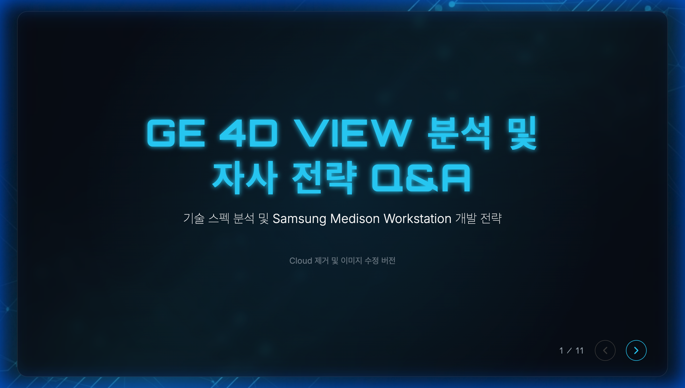
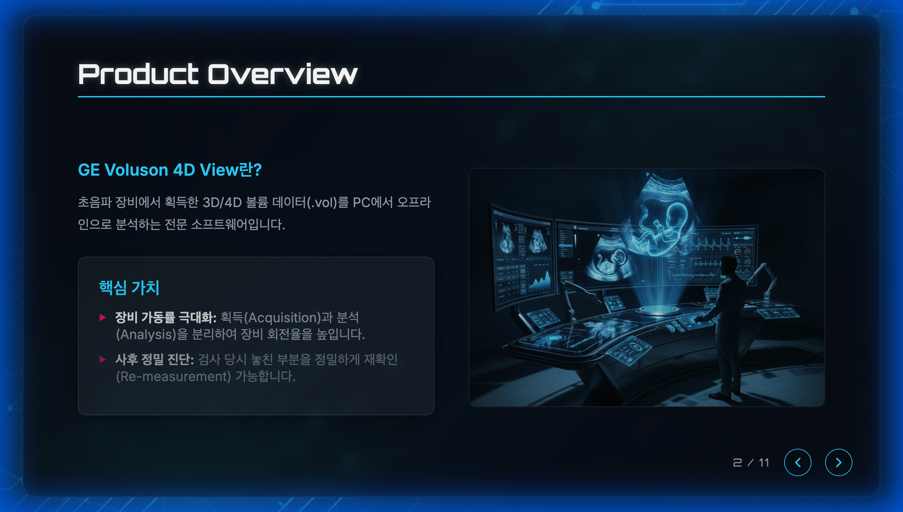
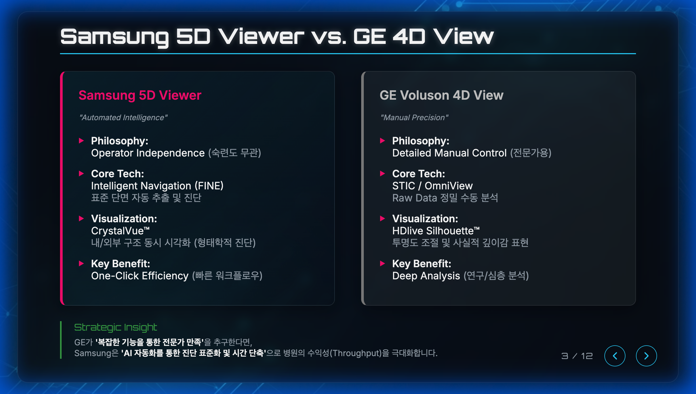
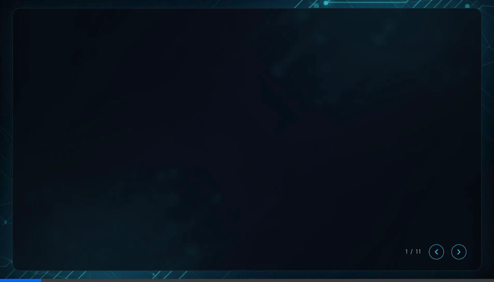

# 현대화된 프레젠테이션 워크스루

기본적인 `index.html`을 전문적이고 하이테크한 프레젠테이션으로 변환했습니다.

## 주요 변경 사항
- **디자인**: 딥 블루/블랙 배경과 네온 시안 강조색을 사용한 다크 모드 미학을 구현했습니다.
- **기술**: 카드와 컨테이너에 글래스모피즘 효과(`backdrop-filter`)를 추가했습니다.
- **구조**: 유지보수 용이성을 위해 코드를 `style.css`와 `script.js`로 분리했습니다.
- **에셋**: 커스텀 배경 및 컨셉 아트를 생성하고 통합했습니다.
- **상호작용**: 키보드 내비게이션(화살표 키) 및 슬라이드 전환 효과를 추가했습니다.

## 검증
브라우저에서 프레젠테이션을 실행하여 디자인을 검증했습니다.

### 슬라이드 1: 타이틀 화면
타이틀 화면은 텍스트 발광 효과와 생성된 추상적인 테크 배경을 특징으로 합니다.

### 슬라이드 2: 제품 개요
이 슬라이드는 생성된 "미래형 워크스테이션" 컨셉 아트와 글래스모피즘 카드를 사용한 레이아웃을 보여줍니다.

### 슬라이드 3: Comparison (Revised) - Why Workstation?
5D Viewer의 한계(단순 뷰어, Raw Data 편집 불가)를 명확히 하고, 이를 극복하는 **Workstation 솔루션(Full Processing, AI Automation)**을 강조하는 방향으로 수정했습니다.

### 브라우저 녹화
전체 검증 세션은 아래에서 확인할 수 있습니다:

